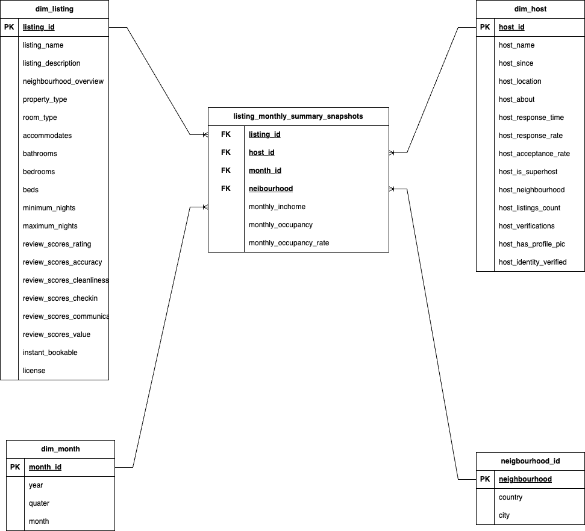

# Airbnb-Monthly-Snapshot-Table-Design
Dimensional Data Modelling
## Table of Contents
- [Introduction](#introduction)
- [datamodel](#data-model)
- [Technologies Used](#technologies-used)
- [Data Source](#data-source)
- [Highlighted Features](#highlighted-features)
- [Results](#results)
- [How to Run](#how-to-run)
- [Contact](#contact)

## Introduction
In this project, we aim to develop a monthly snapshot data model for Airbnb listings, enabling us to track and measure monthly performance metrics such as income and occupancy. Leveraging a state-of-the-art star schema, this model organizes data into a single periodic fact table and four supporting dimension tables, providing a structured and efficient framework for performance analysis.
## Data Model

